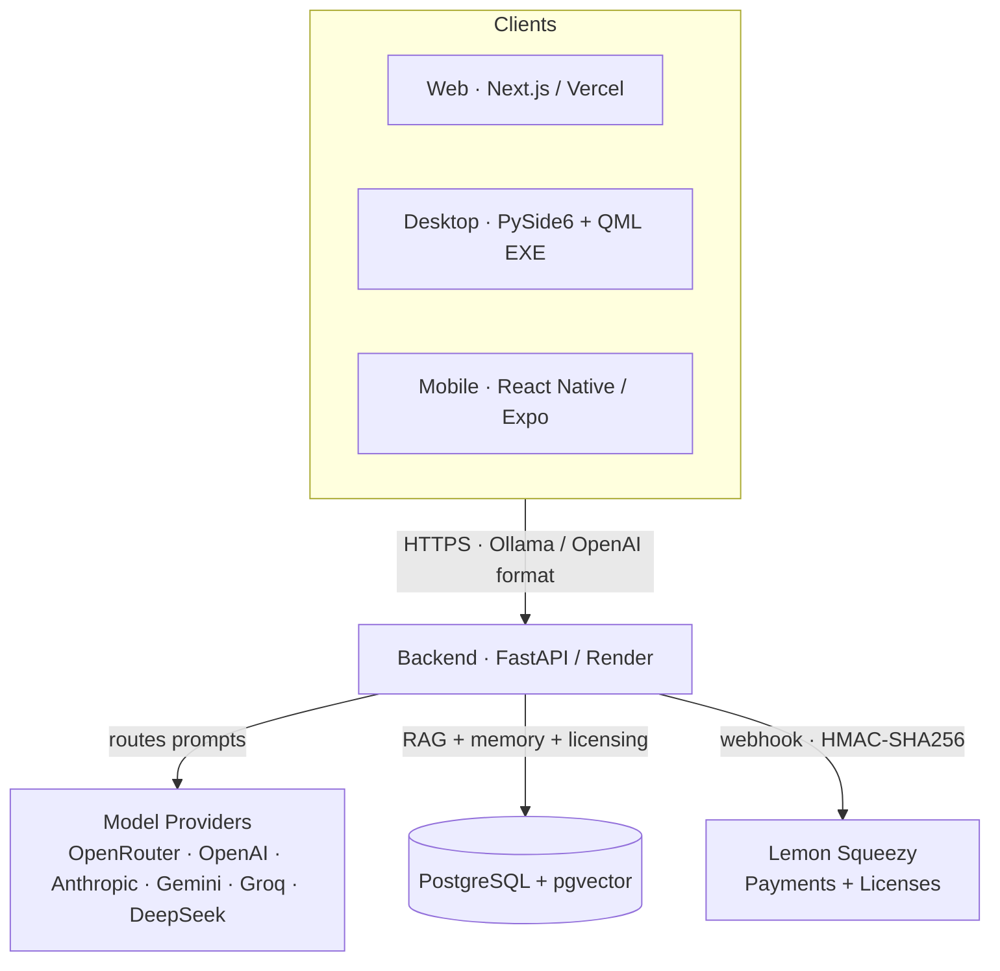
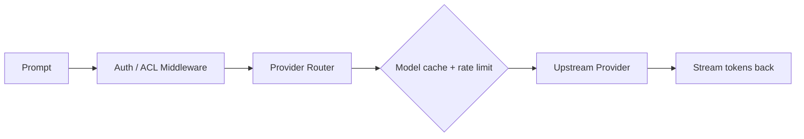
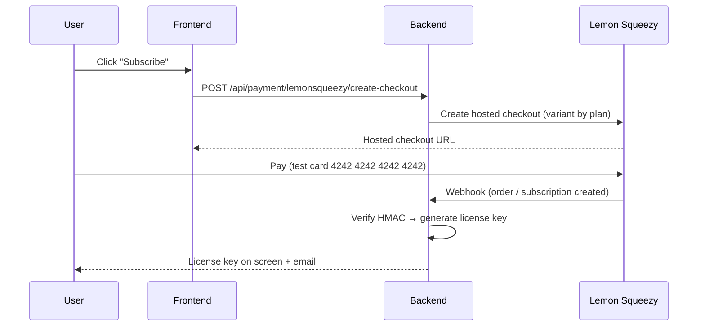

<p align="center">
  
</p>

<h1 align="center">OllamoMUI — The Free AI Gateway</h1>

<p align="center">
  <b>Stop paying $20/mo for ChatGPT &amp; Claude. Run 26 free models behind one Ollama-compatible port.</b>
  <br />
  <i>RAG · Memory · Desktop EXE · Mobile App · Freemium Licensing</i>
</p>

<p align="center">
  <a href="https://ollamomui.vercel.app"></a>
  <a href="https://github.com/rbkhan007/ollamomui/releases/latest"></a>
  
  <a href="https://github.com/rbkhan007/ollamomui/stargazers"></a>
  
  <a href="https://vercel.com"></a>
</p>

---

## 🚀 Demo

| Platform | URL | Status |
|----------|-----|--------|
| **Frontend** | https://ollamomui.vercel.app | ✅ Live |
| **Backend API** | https://ollamomui-backend.onrender.com/api/status | ✅ Live |
| **Desktop EXE** | [Download latest](https://github.com/rbkhan007/ollamomui/releases/latest) | ✅ Ready |
| **Mobile APK** | [Download latest](https://github.com/rbkhan007/ollamomui/releases/latest) | ✅ Buildable |

```bash
# Talk to a free model in one line (Ollama-compatible):
curl http://localhost:11434/api/chat -d '{"model":"free","messages":[{"role":"user","content":"Hello!"}]}'
```

---

## ✨ What Is OllamoMUI?

**OllamoMUI** is a free, self-hosted **AI gateway** that emulates the Ollama API (plus OpenAI / Anthropic formats) and routes your prompts to **26 completely free LLMs** via OpenRouter. It ships with:

- A **RAG knowledge base** (upload PDFs/TXT/CSV, get grounded answers)
- **Persistent memory** (every conversation auto-saves facts & summaries)
- A **desktop GUI** (PySide6 + QML, dark/light theme, auto-updater)
- A **mobile app** (React Native / Expo with full CRUD)
- **License management** — manual key issuance (WhatsApp sales) with optional **Lemon Squeezy** payments + email delivery
- A **freemium proxy** that works with Claude Code, Cursor, OpenCode, and any Ollama-compatible tool

> 💡 Drop-in replacement for Ollama: point any tool at `http://localhost:11434` and it just works.

---

## 🧩 Features

<table>
  <tr>
    <td width="33%">
      <h3>🧠 26 Free LLMs</h3>
      <p>Qwen3 Coder 480B, NVIDIA Nemotron 550B, Llama 3.3 70B, Gemma, and more — all free via OpenRouter.</p>
    </td>
    <td width="33%">
      <h3>📚 RAG Engine</h3>
      <p>Upload PDFs, TXT, or CSV. Hybrid vector (pgvector) + keyword (pg_trgm) search with cross-encoder reranking.</p>
    </td>
    <td width="33%">
      <h3>💾 Persistent Memory</h3>
      <p>Every conversation auto-saves. Facts, summaries, and sessions survive restarts. PostgreSQL-backed.</p>
    </td>
  </tr>
  <tr>
    <td width="33%">
      <h3>🖥️ Desktop App</h3>
      <p>PySide6 + QML GUI with animated backgrounds, dual theme, embedded terminal, and auto-updater.</p>
    </td>
    <td width="33%">
      <h3>📱 Mobile App</h3>
      <p>React Native / Expo with full CRUD, chat, RAG, memory browsing, and license activation.</p>
    </td>
    <td width="33%">
      <h3>🔗 Multi-Provider</h3>
      <p>OpenAI, Anthropic, Google Gemini, Groq, DeepSeek, Mistral, Together — one unified API.</p>
    </td>
  </tr>
  <tr>
    <td width="33%">
      <h3>💳 Payments & Licensing</h3>
      <p>Manual license-key issuance (WhatsApp sales) plus optional Lemon Squeezy integration (global + test mode). Auto license generation + email delivery on purchase.</p>
    </td>
    <td width="33%">
      <h3>🔒 Enterprise Security</h3>
      <p>HTTPS redirect (opt-in), secure cookies, rate limiting, IP allow/block lists, audit logging, password hashing.</p>
    </td>
    <td width="33%">
      <h3>🐳 Self-Hostable</h3>
      <p>Docker Compose with Cloudflare Tunnel sidecar. Deploy anywhere — VPS, NAS, or cloud (Render/Vercel).</p>
    </td>
  </tr>
</table>

---

## 🗺️ Architecture



> **Database topology.** The **desktop EXE** bundles its own FastAPI backend plus a **local PostgreSQL** cluster (inspectable/manageable from **pgAdmin 4**) — its chats, keys, and RAG docs never leave your machine. The **marketing website** and **Android apps** call the cloud Render backend backed by **NeonDB**. You can paste **any provider API key** in Settings for free testing/local use; no license required.

### Request Flow



### Payment & Licensing Flow



---

## 📊 Comparison

| Product | Free Cloud LLMs | RAG | Memory | Desktop GUI | Mobile App | API Proxy | Pricing |
|---------|:---:|:---:|:---:|:---:|:---:|:---:|:---:|
| **OllamoMUI** | ✅ 26 models | ✅ | ✅ | ✅ | ✅ | ✅ | Free + Paid tiers |
| Ollama | ❌ (local only) | ❌ | ❌ | ❌ | ❌ | ✅ | Free |
| LM Studio | ❌ (local only) | ❌ | ❌ | ✅ | ❌ | ❌ | Free |
| Jan | ❌ (local only) | ❌ | ❌ | ✅ | ❌ | ❌ | Free |
| GPT4All | ❌ (local only) | ✅ | ❌ | ✅ | ❌ | ❌ | Free |
| ChatGPT | $20/mo | ❌ | ❌ | ❌ | ✅ | ❌ | $20/mo |
| Claude Pro | $20/mo | ❌ | ❌ | ❌ | ❌ | ❌ | $20/mo |

---

## ⚡ Quick Start

### One-Line Docker

```bash
docker run -d --name ollamomui -p 11434:11434 ghcr.io/rbkhan007/ollamomui:latest
```

### Manual Setup

```bash
git clone https://github.com/rbkhan007/ollamomui.git
cd ollamomui

# Backend
pip install -e ".[dev]"
python -m ollama_emu.main --host 0.0.0.0 --port 11434

# Frontend (separate terminal)
cd frontend
npm install && npm run dev
```

Open **http://localhost:3000** — no API key required for free models.

### Desktop EXE

Download from [Releases](https://github.com/rbkhan007/ollamomui/releases/latest) — a single-click installer that runs the backend + QML GUI and a **self-contained local PostgreSQL** (viewable in **pgAdmin 4**). Bring **your own API key** (OpenAI, Anthropic, Gemini, a local LM Studio server, etc.) in Settings and use it free — no payment needed. See [`desktop/README.md`](desktop/README.md) for the local-DB details.

---

## 💸 Pricing

| Tier | Price | What You Get |
|------|-------|-------------|
| **Free** | $0 | 26 models, playground, limited RAG, 10 req/day |
| **Desktop Pro** | $4.99/mo | Pre-built EXE, auto-updates, offline mode |
| **Mobile Ultimate** | $2.99/mo | Play Store app, full CRUD, notifications |
| **Web Pro** | $9.99/mo | Unlimited RAG, cloud sync, priority support |

> Licenses can also be purchased directly via WhatsApp (manual key delivery). When automated checkout is enabled, payments are powered by [Lemon Squeezy](https://www.lemonsqueezy.com/) — supports test mode, global cards, and taxes handled for you.
> **[View pricing →](https://ollamomui.vercel.app/pricing)**

---

## 📁 Project Structure

```
ollamomui/
├── backend/          # Python FastAPI backend
│   ├── src/ollama_emu/   # Core application
│   └── tests/test_api.py # Integration tests (standalone, run with --online)
├── frontend/         # Next.js marketing site
│   └── src/app/          # Pages & components
├── desktop/          # PySide6 + QML desktop GUI
│   └── src/qml/          # QML components & pages
├── mobile/           # React Native / Expo app
│   └── app/              # Screens
├── deploy/           # Nginx, Docker configs
├── cloudflare/       # Cloudflare Tunnel setup
├── configs/          # Database schema, env examples
├── docs/             # Full documentation
├── promotion/        # Product Hunt, Reddit, Twitter drafts
└── resources/        # Logos, icons, architecture diagrams
```

---

## 📚 Documentation

| Resource | Description |
|----------|-------------|
| [docs/README.md](docs/README.md) | Full installation, configuration & API reference |
| [docs/API.md](docs/API.md) | Complete API endpoint reference |
| [docs/MOBILE.md](docs/MOBILE.md) | Mobile app build & deploy guide |
| [deploy/README.md](deploy/README.md) | Docker, Nginx & Cloudflare deployment |
| [cloudflare/README.md](cloudflare/README.md) | Cloudflare Tunnel setup |
| [CHANGELOG.md](CHANGELOG.md) | Version history |

---

## 🤝 Contributing

1. Fork the repo
2. Create a feature branch: `git checkout -b feat/my-feature`
3. Make your changes
4. Run tests: `python backend/tests/test_api.py --online` (requires a live PostgreSQL + network)
5. Submit a PR

All contributions are welcome — bug fixes, new providers, UI improvements, and documentation.

---

## 📜 License

MIT — Copyright (c) 2024-2026 [Rhasan@dev](https://github.com/rbkhan007)

Built with ❤️ for the open-source AI community.
