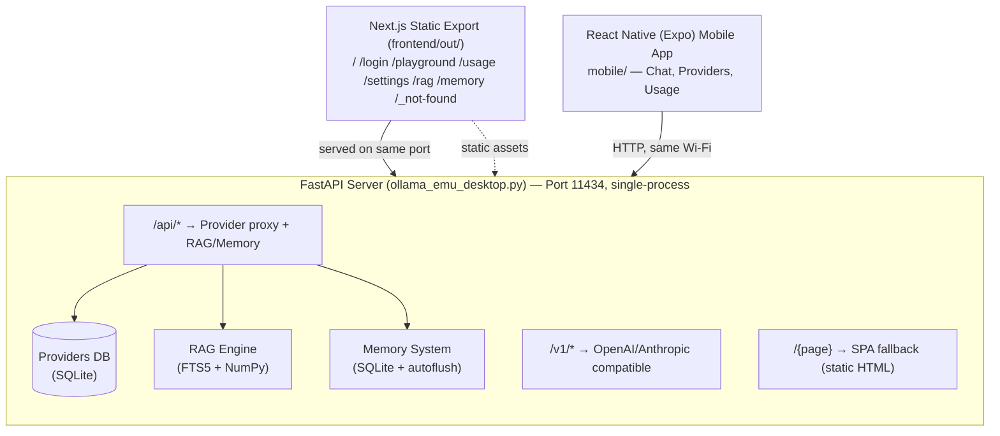

# Ollama Emulator Desktop Ultimate v1.0.0

<p align="center">
  
</p>

**Run a fake Ollama server locally that routes to real free LLM models** via OpenRouter, OpenAI, Anthropic, Groq, DeepSeek, Gemini, and more. Built-in RAG knowledge base, persistent memory, usage analytics, and a polished Next.js dashboard.

Works with **Claude Code**, **OpenCode**, **Cursor**, **Continue.dev**, and any Ollama-compatible AI coding tool — all on a single port (`localhost:11434`).

<p align="center">
  
</p>

## Architecture



---

## Quick Start

```bash
# Windows
run.bat

# macOS / Linux
bash run.sh
```

Opens `http://localhost:11434` automatically. Configure your API key in **Settings**.

---

## Features

| Feature | Description |
|---------|-------------|
| **Ollama-compatible API** | `/api/tags`, `/api/chat`, `/api/generate`, `/api/show` — drop-in replacement |
| **OpenAI-compatible proxy** | `/v1/models`, `/v1/chat/completions`, `/v1/completions` |
| **Anthropic-compatible proxy** | `/v1/messages` — works with Claude Code via `ANTHROPIC_BASE_URL` |
| **Multi-provider routing** | OpenAI, Anthropic, Gemini, Groq, DeepSeek, OpenRouter, Mistral, Together |
| **$0 Free Tier** | 10+ free models through OpenRouter (Gemini Flash, DeepSeek, Llama, Qwen, Phi-4, etc.) |
| **RAG Knowledge Base** | Upload docs, paste text, FTS5 + TF-IDF search |
| **Persistent Memory** | Auto-saves conversations, facts, sessions to SQLite |
| **Usage Analytics** | Real-time token tracking, resonance, accuracy, hourly activity |
| **Local Auth System** | Email/password login, all data stored locally |
| **Theme Support** | Dark/light mode with system preference detection |
| **SPA Dashboard** | 10 pages: Home, Playground, Usage, Settings, RAG, Memory, Login, Register, Setup, Knowledge |

---

## Architecture

```
┌────────────────────────────────────────────────┐
│  Next.js Static Export (frontend/out/)         │
│  /  /login  /playground  /usage  /settings     │
│  /rag  /memory  /_not-found                    │
└──────────────────┬─────────────────────────────┘
                   │ served on same port
┌──────────────────▼─────────────────────────────┐
│  FastAPI Server (ollama_emu_desktop.py)         │
│  Port 11434 — single-process                   │
│                                                 │
│  /api/*          → Provider proxy + RAG/Memory  │
│  /v1/*           → OpenAI/Anthropic compatible  │
│  /{page}         → SPA fallback (static HTML)   │
│                                                 │
│  Providers DB   RAG Engine    Memory System     │
│  (SQLite)       (FTS5+NumPy)  (SQLite+autoflush)│
└─────────────────────────────────────────────────┘
```

---

## API Endpoints

### Ollama-compatible
| Route | Method | Description |
|-------|--------|-------------|
| `/api/tags` | GET | List available models |
| `/api/chat` | POST | Streaming chat completion |
| `/api/generate` | POST | Text generation |
| `/api/show` | GET | Model details |
| `/api/version` | GET | Server version |

### OpenAI-compatible
| Route | Method | Description |
|-------|--------|-------------|
| `/v1/models` | GET | List models |
| `/v1/chat/completions` | POST | Chat completion |
| `/v1/completions` | POST | Text completion |

### Anthropic-compatible
| Route | Method | Description |
|-------|--------|-------------|
| `/v1/messages` | POST | Messages API (streaming) |

### RAG (Knowledge Base)
| Route | Method | Description |
|-------|--------|-------------|
| `/api/rag/stats` | GET | Collection statistics |
| `/api/rag/documents` | GET | List documents |
| `/api/rag/collections` | GET | List collections |
| `/api/rag/upload` | POST | Upload file for indexing |
| `/api/rag/add-text` | POST | Add plain text |
| `/api/rag/search` | POST | Semantic search |
| `/api/rag/context` | GET | Build RAG context |
| `/api/rag/documents/{id}` | DELETE | Remove document |

### Memory
| Route | Method | Description |
|-------|--------|-------------|
| `/api/memory/stats` | GET | Memory statistics |
| `/api/memory/messages` | GET | Conversation messages |
| `/api/memory/facts` | GET/POST | Stored facts |
| `/api/memory/facts/{id}` | DELETE | Remove fact |
| `/api/memory/search` | POST | Search memory |
| `/api/memory/sessions` | GET | List sessions |
| `/api/memory/clear` | POST | Clear memory |

### Usage & Config
| Route | Method | Description |
|-------|--------|-------------|
| `/api/usage/stats` | GET | Real-time usage analytics |
| `/api/status` | GET | Server status |
| `/api/providers` | GET | List provider configs |
| `/api/providers/list` | GET | Detailed provider list |
| `/api/providers/add` | POST | Add custom provider |
| `/api/providers/{name}` | DELETE | Remove provider |
| `/api/config` | POST | Save active provider config |

---

## Using with AI Coding Tools

### Claude Code
```bash
# Set your OpenRouter API key
set OLLAMA_EMU_API_KEY=sk-or-v1-your-key-here

# Point Claude to the emulator
set ANTHROPIC_BASE_URL=http://localhost:11434
set ANTHROPIC_API_KEY=sk-local

# Run Claude with a free model
ANTHROPIC_MODEL=openrouter/auto claude
```

### OpenCode
```json
{
  "provider": {
    "emu": {
      "npm": "@ai-sdk/openai-compatible",
      "name": "Ollama Emulator",
      "options": {
        "baseURL": "http://localhost:11434/v1",
        "apiKey": "sk-local"
      },
      "models": {
        "openrouter/auto": { "name": "OpenRouter Auto (best free)" }
      }
    }
  }
}
```

### Cursor / Continue.dev
```
OpenAI-compatible endpoint:
  Base URL: http://localhost:11434/v1
  API Key:  sk-local
```

---

## Security

- **All data is local** — credentials, keys, and documents never leave your machine
- **Password hashing** — PBKDF2-HMAC-SHA256 with a per-user random salt, stored in a local SQLite database (`auth.db`)
- **Input validation** — provider URLs are scheme-checked and blocked from resolving to private/loopback/metadata addresses (SSRF protection), with path sanitization and size limits on all inputs
- **Secure-by-default binding** — the server binds to `127.0.0.1` and uses a restricted CORS policy; use `--host 0.0.0.0` to opt into LAN exposure (opens CORS to all origins)
- **Error masking** — internal paths and stack traces never exposed to clients
- **File upload safety** — random temp filenames, extension sanitization, 10MB limit

---

## Configuration

### Environment Variables
| Variable | Description |
|----------|-------------|
| `OLLAMA_EMU_API_KEY` | Pre-set API key on startup |
| `OLLAMA_EMU_PROVIDER` | Active provider name (default: `openrouter`) |

### Provider DB
Provider configs are persisted in `providers.db` (SQLite). On first run, defaults for 8 providers are seeded automatically. Add custom providers through the Settings page.

---

## Building

### Standalone EXE (Windows)
```bash
build_exe.bat
```
Produces `dist/OllamaEmu.exe` — a single-file executable with embedded frontend.

### Requirements

- **Python 3.11+** (the backend uses `datetime.UTC`, introduced in 3.11)
- Node.js 18+ (for the frontend build)

### Manual Development
```bash
# Backend
pip install -r requirements.txt
python ollama_emu_desktop.py

# Frontend (separate dev server)
cd frontend
npm install
npm run dev    # http://localhost:3000
```
The dev frontend proxies to the backend on port 11434.

---

## Project Structure

```
├── ollama_emu_desktop.py    # Main server (FastAPI, 1400+ lines)
├── rag.py                   # RAG engine (FTS5 + TF-IDF)
├── memory.py                # Memory system (SQLite + auto-flush)
├── providers.db             # Provider configurations
├── rag.db / memory.db       # RAG & memory databases
├── requirements.txt         # Python dependencies
├── run.bat / run.sh         # One-click launchers
├── build_exe.bat            # PyInstaller build script
├── claude-code-env.bat/.sh  # Turnkey Claude Code launchers
├── opencode.example.json    # OpenCode configuration example
├── .env.example             # Environment variables template
├── frontend/
│   ├── src/
│   │   ├── app/             # Next.js pages (7 pages)
│   │   ├── components/      # Navbar, Icons, Background
│   │   └── lib/             # api, AuthContext, ThemeContext
│   ├── next.config.ts       # Static export config
│   └── package.json
└── README.md
```

---

## Mobile (Android / iOS)

A **React Native (Expo)** app (`mobile/`) is the phone client. It connects to the
desktop/server running `ollama_emu_desktop.py` (same Wi-Fi) and proxies chats to
the configured LLM provider. On first launch the app prompts for the server URL
(e.g. `http://192.168.1.50:11434`).

Run it instantly with **Expo Go** (scan the QR from `npx expo start`) — no build
needed — or produce a standalone APK/AAB with `eas build -p android`.

```bash
cd mobile
npm install
npx expo start        # scan the QR with the Expo Go app on your phone
```

Full instructions, the API contract, and EAS build steps: see **[MOBILE.md](MOBILE.md)**.

---

## License

Copyright (c) 2024-2026 Rhasan@dev. All rights reserved.
