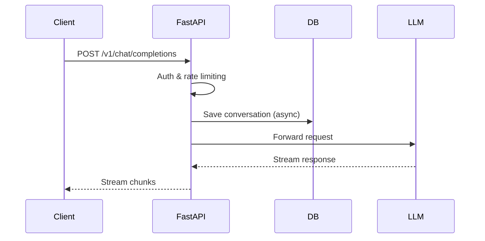
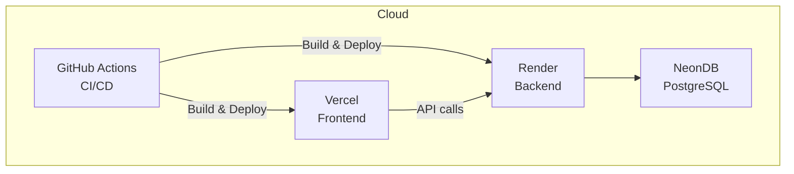

<p align="center">
  
</p>

<h1 align="center">OllamoMUI — Full-Stack AI Gateway Portfolio</h1>

<p align="center">
  <b>FastAPI + Next.js + React Native + PySide6 · 22 static routes · 4-pillar enterprise security</b>
  <br />
  <i>Architecture deep-dive · API docs · System status · Security showcase · Cross-platform case study</i>
</p>

<p align="center">
  <a href="https://ollamomui.vercel.app"></a>
  <a href="https://ollamomui.vercel.app/architecture"></a>
  <a href="https://ollamomui.vercel.app/security"></a>
  <a href="https://ollamomui.vercel.app/status"></a>
  <a href="https://ollamomui.vercel.app/api-docs"></a>
  <a href="https://ollamomui.vercel.app/case-study"></a>
  <br />
  <a href="https://github.com/rbkhan007/ollamomui/releases/latest"></a>
  
  <a href="https://github.com/rbkhan007/ollamomui/stargazers"></a>
  <a href="https://github.com/rbkhan007/ollamomui/actions/workflows/test.yml"></a>
  <a href="https://github.com/rbkhan007/ollamomui/actions/workflows/lighthouse.yml"></a>
  
  
</p>

---

## Live Demo

https://ollamomui.vercel.app

| Portfolio Page | Description |
|----------------|-------------|
| [/architecture](https://ollamomui.vercel.app/architecture) | Request lifecycle & RAG pipeline — inline SVG diagrams showing FastAPI middleware chain, provider routing, streaming response, document chunking, and hybrid search |
| [/api-docs](https://ollamomui.vercel.app/api-docs) | 16 endpoints across Ollama-compatible, OpenAI-compatible, RAG, Memory, and Settings APIs — each with code samples and one-click copy |
| [/status](https://ollamomui.vercel.app/status) | Live client-side health dashboard checking backend, database, RAG, memory, and provider endpoints with auto-refresh |
| [/security](https://ollamomui.vercel.app/security) | 4-pillar enterprise security architecture: Data Sovereignty, Authentication & Access Control, Network & Infrastructure Defense, Operational Integrity & Safety |
| [/case-study](https://ollamomui.vercel.app/case-study) | Cross-platform parity analysis: desktop (Tauri/PySide6), mobile (React Native), and web (Next.js) with features, challenges, and key metrics |
| [/about](https://ollamomui.vercel.app/about) | Project story, timeline, stats, Hire Me section with email CTA and sponsor link, plus security philosophy case study |
| [/download](https://ollamomui.vercel.app/download) | Windows EXE, mobile APK, source code — plus one-click Deploy to Vercel / Render / Railway buttons |

---

## Security Architecture (4 Pillars)

This project was designed with security as a first-class concern, not an afterthought. Every layer includes explicit defense-in-depth measures.

### 1. Data Sovereignty & Privacy
- **Local-first**: Desktop EXE bundles PostgreSQL; all credentials, API keys, and RAG documents stay on the user's hardware
- **Localhost binding**: Server binds to 127.0.0.1 by default; LAN requires explicit opt-in
- **Secure key storage**: API keys hashed with SHA-256 before storage

### 2. Authentication & Access Control
- **PBKDF2-HMAC-SHA256**: Password hashing with per-user random salt and 200,000 iterations
- **RBAC**: Admin, User, Guest roles with per-route permission checks
- **Session management**: JWT with 30-day expiry, HTTP-only + Secure cookies, max 5 active sessions per user

### 3. Network & Infrastructure Defense
- **SSRF protection**: Provider URL schemes and IP addresses validated; private/loopback addresses blocked
- **Rate limiting**: Per-user throttling with configurable thresholds
- **IP filtering**: Configurable allowlists and blocklists
- **HTTPS redirect**: Automatic when SSL is enabled

### 4. Operational Integrity & Safety
- **Audit logging**: All mutations logged with user ID, IP, and timestamp
- **File upload safety**: Extension sanitisation, random filenames, 10MB limit
- **Error masking**: Internal paths and stack traces never exposed to client
- **Memory monitor**: Auto-cleans at 35% RAM usage for graceful degradation

[Full security architecture →](https://ollamomui.vercel.app/security)

---

## What Is OllamoMUI?

**OllamoMUI** is a free, self-hosted **AI gateway** that emulates the Ollama API (plus OpenAI/Anthropic formats) and routes prompts to **26 completely free LLMs** via OpenRouter. It ships with:

- A **RAG knowledge base** (upload PDFs/TXT/CSV, get grounded answers)
- **Persistent memory** (every conversation auto-saves facts & summaries)
- A **desktop GUI** (PySide6 + QML, dark/light theme, auto-updater)
- A **mobile app** (React Native / Expo with full CRUD)
- **License management** with **Lemon Squeezy** payments + email delivery

> Drop-in replacement for Ollama: point any tool at `http://localhost:11434` and it just works.

---

## Features at a Glance

| Area | Technologies |
|------|-------------|
| **Backend** | Python 3.14, FastAPI, PostgreSQL + pgvector, pg_trgm, SQLAlchemy |
| **Frontend Web** | Next.js 15, TypeScript, 22 static routes, SSR/SSG, PWA |
| **Desktop** | PySide6, QML, embedded Python backend, auto-updater |
| **Mobile** | React Native, Expo, Hermes, push notifications |
| **Security** | PBKDF2, JWT, RBAC, SSRF guard, CSP/HSTS, rate limiting, audit logging |
| **Infrastructure** | Docker, Nginx, Cloudflare Tunnel, Vercel, Render, NeonDB |
| **Payments** | Lemon Squeezy, license key generation, email delivery |

---

## Architecture

### System Overview

```mermaid
graph TD
    subgraph Clients
        A[Desktop EXE<br/>PySide6 + QML]
        B[Mobile App<br/>React Native]
        C[Web Browser<br/>Next.js]
    end

    subgraph Backend
        D[FastAPI Server<br/>Python]
        E[Local PostgreSQL<br/>(Desktop bundle)]
        F[Cloud PostgreSQL<br/>NeonDB]
        G[Payment / Licensing<br/>Lemon Squeezy]
    end

    subgraph External
        H[LLM Providers<br/>OpenRouter, OpenAI, Gemini]
    end

    A -->|HTTP| D
    B -->|HTTPS| D
    C -->|HTTPS| D
    D --> E
    D --> F
    D --> G
    D --> H
```

### Request Lifecycle



### Deployment



---

## Project Structure

```
ollamomui/
├── backend/              # Python FastAPI backend
│   ├── src/ollama_emu/       # Core application
│   └── tests/test_api.py     # Integration tests
├── frontend/             # Next.js marketing site (22 pages)
│   └── src/app/             # Pages, components, lib
├── desktop/              # PySide6 + QML desktop GUI
│   └── src/qml/             # QML components & pages
├── mobile/               # React Native / Expo app
│   └── app/                 # Screens
├── deploy/               # Nginx, Docker configs
├── cloudflare/           # Cloudflare Tunnel setup
└── resources/            # Logos, icons, architecture diagrams
```

**Frontend pages** (`frontend/src/app/`):

| Route | Type | Description |
|-------|------|-------------|
| `/` | Server | Homepage with hero, features, FAQ, comparison |
| `/about` | Server | Project story, timeline, Hire Me, security case study |
| `/download` | Server | Downloads + Deploy to Vercel/Render/Railway |
| `/pricing` | Server | Plan cards with Lemon Squeezy checkout |
| `/playground` | Client | Streaming chat UI with model selector |
| `/settings` | Client | Backend URL, provider keys, database URL |
| `/admin` | Client | Manual license key generator |
| `/payment-result` | Client | Post-checkout license key display |
| `/success` | Server | Payment success confirmation |
| `/cancel` | Server | Payment cancellation notice |
| `/memory` | Client | Persistent conversation memory browser |
| `/rag` | Client | RAG knowledge base upload & query |
| `/architecture` | Server | **Portfolio:** request lifecycle & RAG pipeline diagrams |
| `/api-docs` | Server | **Portfolio:** 16-endpoint API reference with copy |
| `/status` | Client | **Portfolio:** live health dashboard |
| `/security` | Server | **Portfolio:** 4-pillar enterprise security |
| `/case-study` | Server | **Portfolio:** cross-platform deep dive |
| `/sitemap.xml` | Server | Dynamic sitemap (18 routes) |
| `/robots.txt` | Server | Robots directive |

---

## Quick Start

### One-Line Docker
```bash
docker run -d --name ollamomui -p 11434:11434 ghcr.io/rbkhan007/ollamomui:latest
```

### Manual Setup
```bash
git clone https://github.com/rbkhan007/ollamomui.git
cd ollamomui
pip install -e ".[dev]"
python -m ollama_emu.main --host 0.0.0.0 --port 11434

# Frontend (separate terminal)
cd frontend
npm install && npm run dev
```

Open **http://localhost:3000** — no API key required for free models.

---

## About the Developer

Built by [Rhasan@dev](https://github.com/rbkhan007). I build full-stack applications, cross-platform desktop/mobile apps, AI/LLM integrations, and developer tools.

**Contact:** rbkhan00009@gmail.com · [GitHub Sponsors](https://github.com/sponsors/rbkhan007) · [Live Portfolio](https://ollamomui.vercel.app)

### Security Case Study

> "When I built OllamoMUI, I started with a simple API wrapper. As the project grew, I realised that security couldn't be an afterthought. I implemented PBKDF2-HMAC-SHA256 password hashing with per-user salts, Role-Based Access Control with fine-grained permissions, and SSRF protection to block malicious requests. The desktop version bundles its own database, ensuring user data never leaves their machine. These security measures are not just features — they are part of a philosophy of data sovereignty and enterprise-grade protection. I am ready to bring this same level of architectural thinking to your remote team."

---

## Work Log

- **2026-07-14 — Portfolio Hire Me pages**
  - 5 new portfolio pages: `/architecture` (request lifecycle SVG + RAG pipeline diagram), `/api-docs` (16 endpoints with copy buttons), `/status` (live health dashboard), `/security` (4-pillar enterprise architecture), `/case-study` (cross-platform parity)
  - Updated `/about` with Hire Me section, security case study, email CTA, sponsor link
  - Updated `/download` with one-click Deploy to Vercel/Render/Railway buttons
  - Updated navbar with all new routes + SVG icons
  - Updated sitemap with all 22 routes
  - Enhanced security pages with four-pillar structure (sovereignty, auth, network, ops)
  - Build: 22/22 static pages, 0 errors

- **2026-07-13 — Final polish & database URL configuration**
  - Added Database URL section to Settings; polished every page; build: 17/17 static pages, 0 errors

- **2026-07-12 — Security audit & playground improvements**
  - Full security audit: auth on sensitive endpoints, CSP/HSTS, CSRF, XSS sanitization, password leak fix
  - Playground: Mermaid diagrams, image rendering, chatbot settings, temperature/max_tokens passthrough

- **2026-07-11 — SEO overhaul & Vercel deployment**
  - SEO: metadata + OG/Twitter on every route, structured data (Organization, WebSite, SoftwareApplication, FAQPage, BreadcrumbList)
  - Responsive design, Settings page, mobile optimization

---

## License

MIT — Copyright (c) 2024-2026 [Rhasan@dev](https://github.com/rbkhan007)
