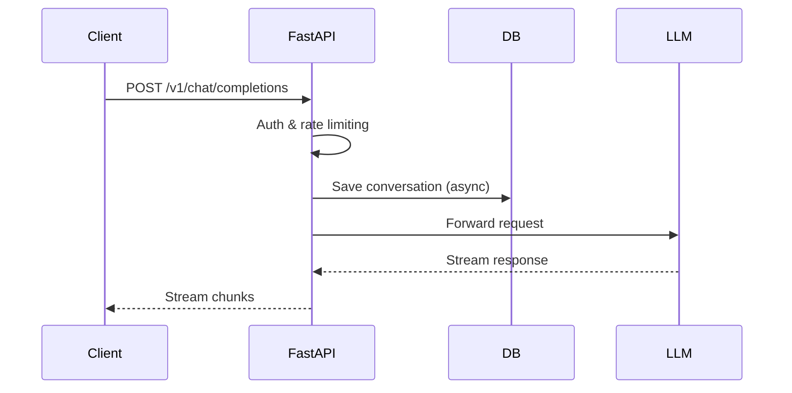

# Ollama Emulator API Reference

Base URL: `http://localhost:11434`

## API Call Flow



## Authentication

### POST /api/auth/register
Create a new user account.

```json
{ "email": "user@example.com", "password": "securePass123!" }
```

**Response** (200):
```json
{ "success": true, "token": "...", "email": "user@example.com", "role": "user" }
```

### POST /api/auth/login
Authenticate and receive a session token.

```json
{ "email": "user@example.com", "password": "securePass123!" }
```

**Response** (200):
```json
{ "success": true, "token": "...", "email": "user@example.com", "role": "user" }
```

### POST /api/auth/logout
Invalidate a session token.

```json
{ "token": "..." }
```

**Response** (200): `{ "success": true }`

### GET /api/auth/verify?token=...
Verify a session token is still valid.

**Response** (200):
```json
{ "valid": true, "email": "user@example.com", "role": "user" }
```

### POST /api/auth/change-password
Change the current user's password (requires authentication via token).

```json
{ "old_password": "...", "new_password": "..." }
```

### POST /api/auth/auto-detect
Detect provider from API key.

```json
{ "api_key": "sk-..." }
```

---

## Providers

### GET /api/providers
List provider configurations (raw dict).

**Response** (200): `{ "openai": { "url": "...", ... }, ... }`

### GET /api/providers/list
List providers with key status information.

**Response** (200):
```json
[{ "name": "openai", "url": "...", "api_key_set": true, "api_key_masked": "****...", ... }]
```

### GET /api/providers/{name}
Get a single provider's details.

**Response** (200):
```json
{ "name": "openai", "url": "...", "type": "openai", "api_key_set": true, ... }
```

### POST /api/providers/add
Add a new provider.

```json
{ "name": "my-provider", "url": "https://...", "type": "openai", "api_key": "sk-...", "models_url": "https://..." }
```

### PUT /api/providers/{name}
Update provider fields (partial update).

```json
{ "default_model": "gpt-4o", "api_key": "sk-new..." }
```

### DELETE /api/providers/{name}
Remove a provider.

### POST /api/providers/activate
Set the active provider for chat completions.

```json
{ "name": "openai" }
```

### POST /api/config
Save provider API key and set as active.

```json
{ "provider": "openai", "api_key": "sk-..." }
```

---

## Models

### GET /api/models
List models for the active provider.

### GET /api/models/free
List free models cached from OpenRouter.

### GET /api/tags
Ollama-compatible model tags endpoint.

### GET /api/ps
List running models (Ollama-compatible).

---

## Chat / Completions

### POST /api/chat
Ollama-compatible chat endpoint.

```json
{ "model": "gpt-3.5-turbo", "messages": [{"role": "user", "content": "Hello"}], "stream": true }
```

### POST /api/generate
Ollama-compatible generate endpoint.

```json
{ "model": "gpt-3.5-turbo", "prompt": "Hello", "stream": true }
```

### POST /v1/chat/completions
OpenAI-compatible chat completions.

```json
{ "model": "gpt-3.5-turbo", "messages": [{"role": "user", "content": "Hello"}], "stream": false }
```

### POST /v1/completions
OpenAI-compatible text completions.

### POST /v1/messages
Anthropic-compatible messages endpoint.

### GET /v1/models
OpenAI-compatible models list.

---

## RAG (Retrieval-Augmented Generation)

### GET /api/rag/stats
Get RAG system statistics.

**Response** (200):
```json
{ "documents": 5, "chunks": 23, "collections": 2, "vectors": 23, "indexed": true, ... }
```

### GET /api/rag/documents
List all indexed documents.

### GET /api/rag/documents/{doc_id}
Get a single document's details.

### GET /api/rag/chunks/{doc_id}
List all chunks for a document.

**Response** (200):
```json
[{ "id": "...", "chunk_index": 0, "content": "...", "tokens": [...] }, ...]
```

### PUT /api/rag/chunks/{chunk_id}
Update a chunk's content and re-embed.

```json
{ "content": "Updated chunk text..." }
```

### POST /api/rag/add-text
Add text as a new document.

```json
{ "text": "Document content...", "name": "my-doc", "collection": "default" }
```

### POST /api/rag/upload
Upload a file as a document (multipart form).

### POST /api/rag/search
Hybrid search (vector + FTS) across documents.

```json
{ "query": "search terms", "top_k": 5, "collection": null }
```

### POST /api/rag/search/vector
Vector-only semantic search.

### POST /api/rag/search/fts
Full-text search only.

### DELETE /api/rag/documents/{doc_id}
Delete a document and all its chunks.

### POST /api/rag/reindex/{doc_id}
Re-embed all chunks for a document.

### POST /api/rag/clear
Clear all documents (optionally per collection).

```json
{ "collection": "default" }
```

### GET /api/rag/context
Build RAG context string for injection.

### POST /api/rag/context-inject
Inject RAG context into a message list.

---

## Memory

### GET /api/memory/stats
Get memory system statistics.

### GET /api/memory/messages?session_id=&limit=100&offset=0
List memory messages.

### GET /api/memory/messages/{msg_id}
Get a single message.

### DELETE /api/memory/messages/{msg_id}
Delete a single message.

### DELETE /api/memory/messages
Clear all messages (requires `confirm=true`).

```json
{ "confirm": true }
```

### GET /api/memory/sessions
List conversation sessions.

### GET /api/memory/facts?session_id=&limit=50
List stored facts.

### POST /api/memory/facts
Add a fact.

```json
{ "fact": "...", "importance": "normal", "session_id": "default" }
```

### DELETE /api/memory/facts/{fact_id}
Delete a fact.

### POST /api/memory/search
Search memories by query.

```json
{ "query": "...", "limit": 20, "session_id": null }
```

### POST /api/memory/clear
Clear memories for a session (or all).

### GET /api/memory/context
Build memory context string.

---

## Users (Admin)

### GET /api/users
List all users (admin only, requires auth token).

### GET /api/users/{email}
Get a single user's details (admin only).

### PUT /api/users/{email}
Update a user's role (admin only).

```json
{ "role": "power_user" }
```

### DELETE /api/users/{email}
Delete a user (admin only, cannot delete self).

---

## API Keys

### POST /api/auth/api-keys
Create a new API key (admin only).

```json
{ "name": "my-key", "role": "user", "scopes": ["read", "write"] }
```

### GET /api/auth/api-keys
List all API keys (admin only).

### DELETE /api/auth/api-keys/{key_id}
Revoke an API key (admin only).

---

## Usage

### GET /api/usage/stats
Get usage statistics.

**Response** (200):
```json
{ "total_requests": 100, "total_tokens": 50000, "successes": 95, "resonance": 95.0, "by_model": {...}, ... }
```

### POST /api/usage/clear
Clear usage logs.

---

## Export / Import

### GET /api/export
Export all providers, memory facts, and RAG documents as JSON.

### POST /api/import
Import providers and memory facts from JSON.

```json
{ "providers": [...], "memory_facts": [...] }
```

---

## System

### GET /api/version
Get application version.

### GET /api/status
Get server status (active provider, key state, model count).

### GET /api/device
Get device identity information.

### GET /api/db/schema
Get database schema version and sync status.

### GET /api/acl/stats
Get ACL statistics (admin only).

### GET /api/acl/roles
List roles and their permissions.

### GET /api/acl/audit-log?limit=100&event=&email=
Get audit log entries (admin only).

---

## Error Responses

All errors follow a consistent format:

```json
{ "detail": "Description of the error" }
```

Common HTTP status codes:
- **200** — Success
- **400** — Bad request (validation error)
- **401** — Not authenticated
- **403** — Permission denied
- **404** — Resource not found
- **409** — Conflict (e.g., duplicate email)
- **422** — Validation error (Pydantic)
- **429** — Rate limited
- **500** — Internal server error
- **503** — Service temporarily unavailable
