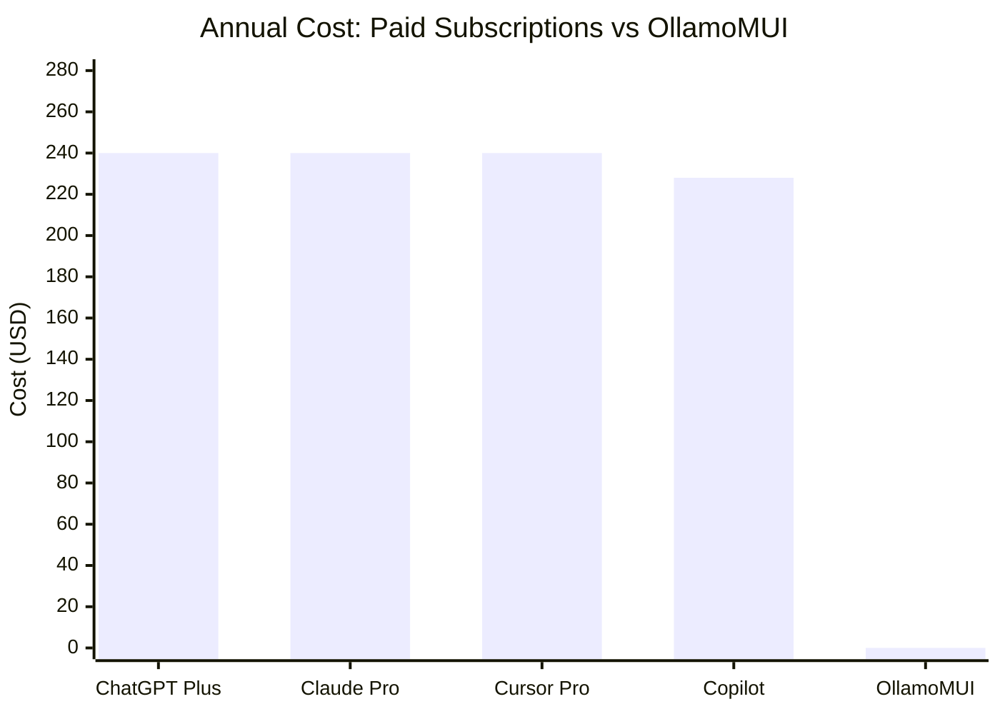
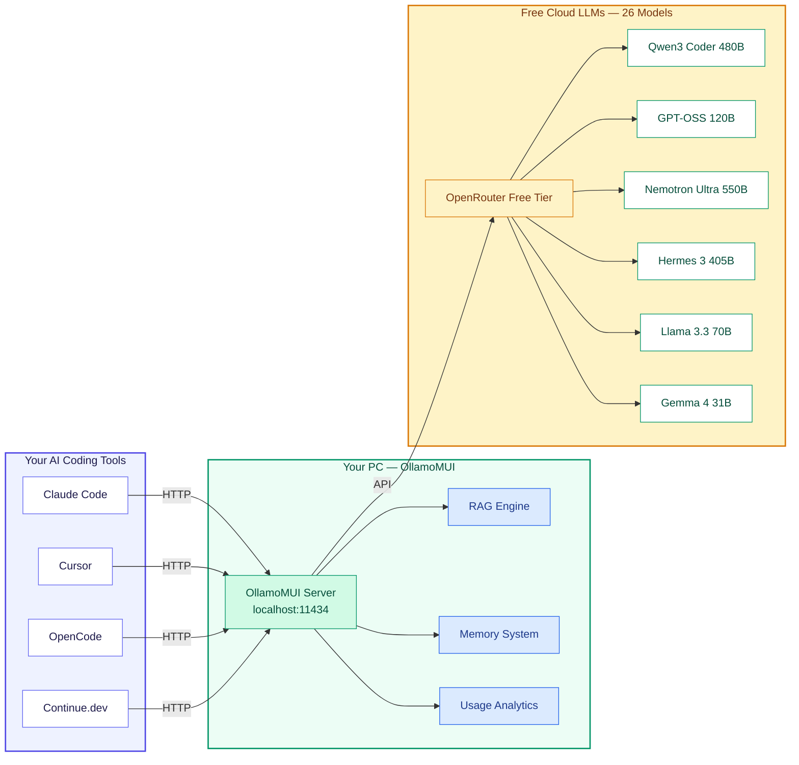
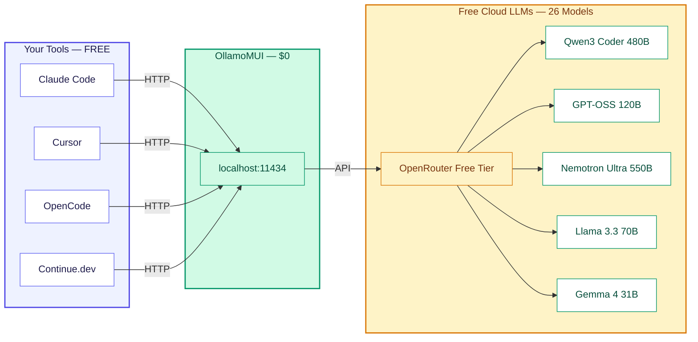
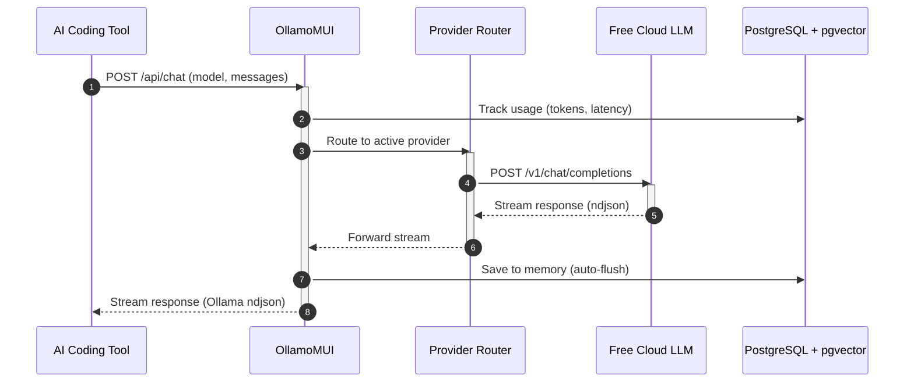
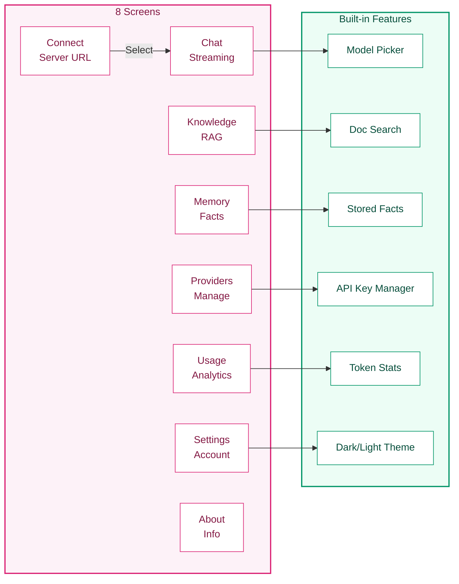

# OllamoMUI — Stop Paying $20/mo for Claude & ChatGPT

<p align="center">
  
</p>

<p align="center">
  <b>Stop paying $20/mo for Claude & ChatGPT. Get 26 free models on one port.</b>
</p>

<p align="center">
  <a href="https://vercel.com"></a>
  <a href="https://github.com/rbkhan007/ollamomui/releases/latest"></a>
  
  
  
  
  <a href="https://github.com/rbkhan007/ollamomui/stargazers"></a>
</p>

---

## Why Are You Still Paying $20/mo?

| Service | Monthly Cost | Annual Cost | Models Included |
|---------|-------------|-------------|-----------------|
| ChatGPT Plus | $20 | $240 | GPT-4o only |
| Claude Pro | $20 | $240 | Claude 3.5 Sonnet only |
| Cursor Pro | $20 | $240 | Limited GPT-4 requests |
| GitHub Copilot | $10-19 | $120-228 | Limited to VS Code |
| **OllamoMUI** | **$0** | **$0** | **26 free models** |

## Cost Comparison



**OllamoMUI: $0/year.** Same quality. Full privacy. No limits.

---

## Free Models You Get (26 Free Models via OpenRouter)

| Rank | Model | Provider | Size | Best For |
|------|-------|----------|------|----------|
| 1 | **Qwen3 Coder** | Alibaba | 480B A35B | Code generation, complex tasks |
| 2 | **NVIDIA Nemotron 3 Ultra** | NVIDIA | 550B A55B | High-quality reasoning |
| 3 | **Nous Hermes 3** | Nous Research | 405B | Creative, roleplay |
| 4 | **OpenAI GPT-OSS** | OpenAI | 120B | General purpose, reasoning |
| 5 | **NVIDIA Nemotron 3 Super** | NVIDIA | 120B A12B | Fast, capable |
| 6 | **Qwen3 Next 80B** | Alibaba | 80B A3B | Fast inference |
| 7 | **Meta Llama 3.3** | Meta | 70B | General purpose |
| 8 | **Google Gemma 4 31B** | Google | 31B | General chat, code |
| 9 | **Venice Uncensored** | CognitiveComputations | 24B | Uncensored chat |
| 10 | **Google Gemma 4 26B** | Google | 26B A4B | Fast, efficient |
| 11 | **NVIDIA Nemotron 3 Nano** | NVIDIA | 30B A3B | Fast reasoning |
| 12 | **NVIDIA Nemotron Nano 12B VL** | NVIDIA | 12B | Vision + language |
| 13 | **NVIDIA Nemotron Nano 9B** | NVIDIA | 9B | Ultra-fast |
| 14 | **Cohere North Mini Code** | Cohere | - | Code generation |
| 15 | **Tencent Hy3** | Tencent | - | Multilingual |
| 16 | **Poolside Laguna M.1** | Poolside | - | Code generation |
| 17 | **Poolside Laguna XS 2.1** | Poolside | - | Fast code |
| 18 | **OpenAI GPT-OSS 20B** | OpenAI | 20B | Fast general |
| 19 | **Meta Llama 3.2 3B** | Meta | 3B | Ultra-fast |
| 20 | **LiquidAI LFM2.5 1.2B Thinking** | LiquidAI | 1.2B | Reasoning |
| 21 | **LiquidAI LFM2.5 1.2B Instruct** | LiquidAI | 1.2B | Chat |
| 22 | **NVIDIA Nemotron 3.5 Content Safety** | NVIDIA | - | Safety filtering |
| 23 | **Free Models Router** | OpenRouter | - | Auto-selects best free model |
| 24 | **Google Lyria 3 Pro Preview** | Google | - | Music generation |
| 25 | **Google Lyria 3 Clip Preview** | Google | - | Music clips |
| 26 | **NVIDIA Nemotron 3 Nano Omni** | NVIDIA | 30B A3B | Multimodal reasoning |

**All 100% free through OpenRouter's free tier.** No credit card. No limits. No catches.
Live model list: [openrouter.ai/models](https://openrouter.ai/models)

---

## How It Works



**OllamoMUI** pretends to be Ollama (`localhost:11434`) but routes your prompts to **free cloud LLMs**. Your coding tools (Claude Code, Cursor, OpenCode) don't know the difference — they think they're talking to a local model, but you're getting cloud-quality responses for free.

---

## Quick Start

### Option 1: Download the EXE (Windows)
```bash
# Download OllamoMUI.exe from:
# https://github.com/rbkhan007/ollamomui/releases/latest

# Double-click to run
OllamoMUI.exe
```

### Option 2: Download the APK (Android)
```bash
# Download OllamoMUI.apk from the same release
# Install on your phone, connect to your PC's IP
```

### Option 3: Run from Source
```bash
git clone https://github.com/rbkhan007/ollamomui.git
cd ollamomui

# Windows
run.bat

# macOS / Linux
bash run.sh
```

Opens `http://localhost:11434` automatically. Add your API key in **Settings** and pick a free model. Done.

---

## Download & Install

| Platform | What You Get | Link |
|----------|-------------|------|
| **Windows EXE** | Single-file `OllamoMUI.exe` (embedded dashboard, no install) | [Download](https://github.com/rbkhan007/ollamomui/releases/latest) |
| **Android APK** | Branded app with 8 screens (Chat, RAG, Memory, Providers, Usage, Settings, About) | [Download](https://github.com/rbkhan007/ollamomui/releases/latest) |
| **From Source** | `run.bat` / `run.sh` | [Clone & Run](#quick-start) |
| **npm** | `@rbkhan007/ollamomui` | [GitHub Packages](#install-from-github-packages) |
| **Web (Free)** | Live demo on Vercel | [Open Free Tier](https://ollamomui.vercel.app) |

---

## Features

| Feature | What It Does |
|---------|-------------|
| **Ollama API** | `/api/tags`, `/api/chat`, `/api/generate` — drop-in replacement |
| **OpenAI API** | `/v1/models`, `/v1/chat/completions` — works with any OpenAI client |
| **Anthropic API** | `/v1/messages` — works with Claude Code via `ANTHROPIC_BASE_URL` |
| **26 Free Models** | Qwen3 Coder 480B, GPT-OSS 120B, Nemotron Ultra 550B, Llama 3.3, Gemma 4 |
| **Model Catalog** | 9 providers with fallback models stored in PostgreSQL — works without API keys |
| **Auto-Detect API Key** | Paste any provider's key, OllamoMUI detects which provider it belongs to |
| **Models Browser** | Search, filter (free/paid), provider stats at `/models` |
| **Multi-Provider** | OpenRouter, OpenAI, Anthropic, Gemini, Groq, DeepSeek, Mistral, Together |
| **RAG Knowledge Base** | Upload docs, paste text, PostgreSQL full-text search + pgvector cosine similarity |
| **Persistent Memory** | Auto-saves conversations, facts, sessions to PostgreSQL |
| **Usage Analytics** | Real-time token tracking, resonance, accuracy, hourly activity |
| **RBAC & Rate Limiting** | Role-based access control, per-user rate limits, audit logging |
| **Local Auth** | Email/password login, all data stays on your machine |
| **Dark/Light Theme** | System preference detection, manual toggle, high-contrast light mode |
| **Mobile App** | 8-screen React Native app (EXPO) with full parity |
| **One-Click Launch** | `run.bat` / `run.sh` — live in 2 seconds |

---

## Why Build Your Own LLM Gateway?

### The Problem
Every AI coding tool needs a subscription:

That's **$60+/month** just to use different tools.

### The Solution
**OllamoMUI** sits in the middle. One server. One port. All tools work.



**You save $240+/year.** The same quality. Zero cost. Full privacy.

---

## Using with AI Coding Tools

### Claude Code
```bash
set OLLAMA_EMU_API_KEY=sk-or-v1-your-key-here
set ANTHROPIC_BASE_URL=http://localhost:11434
set ANTHROPIC_API_KEY=sk-local
ANTHROPIC_MODEL=openrouter/auto claude
```

### OpenCode
```json
{
  "provider": {
    "emu": {
      "npm": "@ai-sdk/openai-compatible",
      "name": "OllamoMUI",
      "options": {
        "baseURL": "http://localhost:11434/v1",
        "apiKey": "sk-local"
      },
      "models": {
        "openrouter/auto": { "name": "OpenRouter Auto (best free)" }
      }
    }
  }
}
```

### Cursor / Continue.dev
```
OpenAI-compatible endpoint:
  Base URL: http://localhost:11434/v1
  API Key:  sk-local
```

### Any Ollama Client
```
OLLAMA_HOST=http://localhost:11434 ollama list
```

---

## API Endpoints

### Request Lifecycle



### Ollama-Compatible
| Route | Method | Description |
|-------|--------|-------------|
| `/api/tags` | GET | List available models |
| `/api/chat` | POST | Streaming chat completion |
| `/api/generate` | POST | Text generation |
| `/api/show` | GET | Model details |

### OpenAI-Compatible
| Route | Method | Description |
|-------|--------|-------------|
| `/v1/models` | GET | List models |
| `/v1/chat/completions` | POST | Chat completion |
| `/v1/completions` | POST | Text completion |

### Anthropic-Compatible
| Route | Method | Description |
|-------|--------|-------------|
| `/v1/messages` | POST | Messages API (streaming) |

### RAG (Knowledge Base)
| Route | Method | Description |
|-------|--------|-------------|
| `/api/rag/upload` | POST | Upload file for indexing |
| `/api/rag/add-text` | POST | Add plain text |
| `/api/rag/search` | POST | Semantic search |
| `/api/rag/documents` | GET | List documents |
| `/api/rag/documents/{id}` | DELETE | Remove document |

### Memory
| Route | Method | Description |
|-------|--------|-------------|
| `/api/memory/stats` | GET | Memory statistics |
| `/api/memory/messages` | GET | Conversation messages |
| `/api/memory/facts` | GET/POST | Stored facts |
| `/api/memory/search` | POST | Search memory |

### Provider Management
| Route | Method | Description |
|-------|--------|-------------|
| `/api/status` | GET | Active provider, key status |
| `/api/providers/list` | GET | Configured providers |
| `/api/providers/activate` | POST | Switch active provider |
| `/api/providers/add` | POST | Add custom provider |
| `/api/providers/{name}` | DELETE | Remove provider |
| `/api/config` | POST | Save provider config |
| `/api/models/all` | GET | All models (catalog + live) with fallback |
| `/api/auth/auto-detect` | POST | Detect provider from API key |

### RBAC & Security
| Route | Method | Description |
|-------|--------|-------------|
| `/api/auth/login` | POST | Email/password login |
| `/api/auth/register` | POST | Register new account |
| `/api/auth/verify` | POST | Verify token |
| `/api/auth/change-password` | POST | Change password |
| `/api/acl/stats` | GET | ACL statistics |
| `/api/acl/roles` | GET | Role definitions |
| `/api/audit/log` | GET | Audit log (admin only) |

---

## Architecture

```mermaid
flowchart TB
    subgraph Clients["AI Coding Tools"]
        direction LR
        CC["Claude Code"]
        CU["Cursor"]
        OC["OpenCode"]
        CD["Continue.dev"]
    end

    subgraph Desktop["Desktop — EXE / Source"]
        direction TB
        API["FastAPI Server<br/>:11434"]
        RAG["RAG Engine<br/>pgvector + FTS"]
        MEM["Memory System<br/>PostgreSQL + Auto-flush"]
        AUTH["Auth System<br/>PBKDF2 + Salt"]
        ACL["RBAC + Rate Limiter<br/>IP Filter + Audit"]
        ROUTER["Provider Router"]
        DB[("PostgreSQL<br/>providers | users | sessions<br/>rag | memory | acl<br/>model_catalog | api_keys")]
    end

    subgraph Providers["Cloud Providers"]
        direction TB
        OR["OpenRouter<br/>26 free models"]
        OAI["OpenAI"]
        ANTH["Anthropic"]
        GEM["Google Gemini"]
        DS["DeepSeek"]
        GRQ["Groq"]
        MST["Mistral"]
        TGH["Together"]
    end

    subgraph Frontend["Web Dashboard"]
        direction TB
        NEXT["Next.js<br/>Static Export"]
        PAGES["~15 Pages<br/>Playground, RAG, Memory<br/>Usage, Settings, About"]
    end

    subgraph Mobile["Mobile App"]
        direction TB
        RN["React Native<br/>Expo"]
        MSCREENS["8 Screens<br/>Full Parity"]
    end

    CC -->|HTTP| API
    CU -->|HTTP| API
    OC -->|HTTP| API
    CD -->|HTTP| API
    NEXT -->|HTTP| API
    RN -->|HTTP| API
    API --> RAG
    API --> MEM
    API --> AUTH
    API --> ACL
    API --> ROUTER
    RAG --> DB
    MEM --> DB
    AUTH --> DB
    ACL --> DB
    ROUTER --> DB
    ROUTER -->|API| OR
    ROUTER --> OAI
    ROUTER --> ANTH
    ROUTER --> GEM
    ROUTER --> DS
    ROUTER --> GRQ
    ROUTER --> MST
    ROUTER --> TGH

    style Clients fill:#eef2ff,stroke:#4f46e5,stroke-width:2px,color:#1e1b4b
    style Desktop fill:#ecfdf5,stroke:#059669,stroke-width:2px,color:#064e3b
    style Providers fill:#fef3c7,stroke:#d97706,stroke-width:2px,color:#78350f
    style Frontend fill:#fefce8,stroke:#ca8a04,stroke-width:2px,color:#713f12
    style Mobile fill:#fdf2f8,stroke:#db2777,stroke-width:2px,color:#831843
    style CC fill:#fff,stroke:#6366f1,color:#1e1b4b
    style CU fill:#fff,stroke:#6366f1,color:#1e1b4b
    style OC fill:#fff,stroke:#6366f1,color:#1e1b4b
    style CD fill:#fff,stroke:#6366f1,color:#1e1b4b
    style API fill:#d1fae5,stroke:#059669,color:#064e3b
    style RAG fill:#dbeafe,stroke:#2563eb,color:#1e3a8a
    style MEM fill:#dbeafe,stroke:#2563eb,color:#1e3a8a
    style AUTH fill:#dbeafe,stroke:#2563eb,color:#1e3a8a
    style ROUTER fill:#fef3c7,stroke:#d97706,color:#78350f
    style DB fill:#f3f4f6,stroke:#6b7280,color:#374151
    style OR fill:#fef3c7,stroke:#d97706,color:#78350f
    style OAI fill:#fff,stroke:#6b7280,color:#374151
    style ANTH fill:#fff,stroke:#6b7280,color:#374151
    style GEM fill:#fff,stroke:#6b7280,color:#374151
    style DS fill:#fff,stroke:#6b7280,color:#374151
    style GRQ fill:#fff,stroke:#6b7280,color:#374151
    style MST fill:#fff,stroke:#6b7280,color:#374151
    style TGH fill:#fff,stroke:#6b7280,color:#374151
    style NEXT fill:#fefce8,stroke:#ca8a04,color:#713f12
    style PAGES fill:#fefce8,stroke:#ca8a04,color:#713f12
    style RN fill:#fdf2f8,stroke:#db2777,color:#831843
    style MSCREENS fill:#fdf2f8,stroke:#db2777,color:#831843
```



---

## Security

- **All data is local** — credentials, keys, and documents never leave your machine
- **Password hashing** — PBKDF2-HMAC-SHA256 with per-user random salt
- **RBAC** — role-based access control (admin/user) with per-route permission checks
- **Rate limiting** — per-user request throttling (configurable limits)
- **Session management** — 30-day token expiry, max 5 active sessions per user
- **IP filtering** — allowlist/blocklist for network-level access control
- **Audit logging** — all mutations logged with user, IP, and timestamp
- **SSRF protection** — provider URLs are scheme-checked and blocked from private/loopback addresses
- **Secure binding** — server binds to `127.0.0.1` by default; use `--host 0.0.0.0` for LAN
- **Error masking** — internal paths and stack traces never exposed
- **File upload safety** — random temp filenames, extension sanitization, 10MB limit

---

## Configuration

### Environment Variables
| Variable | Description |
|----------|-------------|
| `OLLAMA_EMU_API_KEY` | Pre-set API key on startup |
| `OLLAMA_EMU_PROVIDER` | Active provider name (default: `openrouter`) |
| `OLLAMA_EMU_ADMIN_EMAIL` | Admin account email (default: `admin@localhost`) |
| `OLLAMA_EMU_DEMO_PASSWORD` | Demo account password (default: `changeme123`) |
| `OLLAMA_EMU_JWT_SECRET` | JWT signing secret (auto-generated if not set) |
| `OLLAMA_EMU_RATE_LIMIT` | Max requests per 15-min window (default: `60`) |
| `PGPASSWORD` | PostgreSQL password (default: `postgres`) |
| `DATABASE_URL` | PostgreSQL connection string (frontend env) |

### Model Catalog
On startup, OllamoMUI saves a curated catalog of 9 providers with their models to PostgreSQL (`model_catalog` table). When no API key is configured for a provider, the catalog serves as a fallback so the Models Browser always shows available models. This means you can browse and discover models before adding any API keys.

### Provider Database
Provider configs are persisted in PostgreSQL (`providers` table). On first run, 8 providers are seeded automatically. Add custom providers through the Settings page or mobile app.

---

## Building

### Standalone EXE (Windows)
```bash
python desktop/build.py --onefile
```
Produces `dist/ollamomui.exe` — a single-file executable with embedded frontend.

### Requirements
- **Python 3.11+** (backend uses `datetime.UTC`)
- **Node.js 18+** (frontend build)

### Manual Development
```bash
# Backend
pip install -r requirements.txt
python -m ollama_emu.main

# Frontend (separate dev server)
cd frontend
npm install
npm run dev    # http://localhost:3000
```

### Deploy the Public Site (Free on Vercel)
1. Go to [vercel.com/new](https://vercel.com/new) and import your GitHub repo
2. Set **Root Directory** to `frontend`
3. Add env vars: `NEXT_PUBLIC_API_BASE`, `NEXT_PUBLIC_SITE_URL`
4. Deploy — live at `https://<project>.vercel.app`

> Or use GitHub Pages (alternative): push to `main` — the [`deploy-pages.yml`](.github/workflows/deploy-pages.yml) workflow builds and publishes to `https://rbkhan007.github.io/ollamomui`.

---

## Mobile App

A **React Native (Expo)** app with 8 screens:



| Screen | What It Does |
|--------|-------------|
| **Connect** | Enter server URL, test connection |
| **Chat** | Streaming playground with model picker |
| **Knowledge** | RAG: upload docs, search, manage collections |
| **Memory** | Facts, sessions, recent messages |
| **Providers** | Set active provider, paste API keys, add/delete |
| **Usage** | Token tracking, per-model stats |
| **Settings** | Server URL, account, device info |
| **About** | App overview, supported tools |

```bash
cd mobile
npm install
npx expo start        # scan QR with Expo Go
```

Full details: **[MOBILE.md](MOBILE.md)**

---

## Project Structure

```mermaid
graph TB
    ROOT["OllamoMUI"] --> PY["Python Backend"]
    ROOT --> FE["Next.js Frontend"]
    ROOT --> MOB["React Native Mobile"]
    ROOT --> CI["GitHub Actions"]

    PY --> SERVER["ollama_emu/main.py<br/>FastAPI Server"]
    PY --> RAG["rag.py<br/>RAG Engine"]
    PY --> MEM["memory.py<br/>Memory System"]
    PY --> DBMOD["db.py<br/>PostgreSQL Pool + Schema"]
    PY --> ACLMOD["acl.py<br/>RBAC + Rate Limiter"]
    PY --> REQ["requirements.txt"]

    FE --> APP["src/app/<br/>~16 Pages"]
    FE --> COMP["src/components/<br/>Navbar, Icons, Footer"]
    FE --> LIB["src/lib/<br/>API, Auth, Theme"]
    FE --> NC["next.config.js<br/>Static Export"]

    MOB --> MAPP["app/<br/>8 Screens"]
    MOB --> MCOMP["components/<br/>UI, BottomNav"]
    MOB --> MLIB["lib/<br/>API Client"]
    MOB --> MJ["app.json<br/>Expo Config"]

    CI --> DEPLOY["deploy-pages.yml<br/>GitHub Pages"]
    CI --> RELEASE["release.yml<br/>EXE + APK"]
    CI --> LIGHTHOUSE["lighthouse.yml<br/>Audit"]

    style ROOT fill:#ecfdf5,stroke:#059669,stroke-width:3px,color:#064e3b
    style PY fill:#eef2ff,stroke:#4f46e5,stroke-width:2px,color:#1e1b4b
    style FE fill:#fefce8,stroke:#ca8a04,stroke-width:2px,color:#713f12
    style MOB fill:#fdf2f8,stroke:#db2777,stroke-width:2px,color:#831843
    style CI fill:#f5f3ff,stroke:#7c3aed,stroke-width:2px,color:#4c1d95
    style SERVER fill:#eef2ff,stroke:#4f46e5,color:#1e1b4b
    style RAG fill:#eef2ff,stroke:#4f46e5,color:#1e1b4b
    style MEM fill:#eef2ff,stroke:#4f46e5,color:#1e1b4b
    style REQ fill:#eef2ff,stroke:#4f46e5,color:#1e1b4b
    style APP fill:#fefce8,stroke:#ca8a04,color:#713f12
    style COMP fill:#fefce8,stroke:#ca8a04,color:#713f12
    style LIB fill:#fefce8,stroke:#ca8a04,color:#713f12
    style NC fill:#fefce8,stroke:#ca8a04,color:#713f12
    style MAPP fill:#fdf2f8,stroke:#db2777,color:#831843
    style MCOMP fill:#fdf2f8,stroke:#db2777,color:#831843
    style MLIB fill:#fdf2f8,stroke:#db2777,color:#831843
    style MJ fill:#fdf2f8,stroke:#db2777,color:#831843
    style DEPLOY fill:#f5f3ff,stroke:#7c3aed,color:#4c1d95
    style RELEASE fill:#f5f3ff,stroke:#7c3aed,color:#4c1d95
    style LIGHTHOUSE fill:#f5f3ff,stroke:#7c3aed,color:#4c1d95
```



---

## Share & Spread the Word

If this saves you a subscription, **share it**:

- **Twitter/X**: [Tweet about OllamoMUI](https://twitter.com/intent/tweet?text=Stop%20paying%20%2420%2Fmo%20for%20Claude%20%26%20ChatGPT.%20OllamoMUI%20gives%20you%2026%20free%20LLMs%20on%20one%20port.%20%23OllamoMUI%20%23FreeLLM%20%23AI)
- **Reddit**: Share in r/LocalLLaMA, r/selfhosted, r/ChatGPT, r/opensource
- **Hacker News**: [Submit to HN](https://news.ycombinator.com/submitlink?u=https://github.com/rbkhan007/ollamomui&t=OllamoMUI%20%E2%80%94%2026%20free%20LLMs%20on%20one%20port)
- **GitHub**: Star the repo, fork it, open issues

**The only price is virality.** Star the repo and tell a friend.

---

## Contributing

1. Fork the repo
2. Create a feature branch
3. Make your changes
4. Run `tsc --noEmit` (frontend) and `python -m py_compile backend/src/ollama_emu/main.py` (backend)
5. Ensure `python backend/tests/test_api.py --online` passes (requires PostgreSQL running)
6. Submit a PR

---

## License

Copyright (c) 2024-2026 Rhasan@dev. All rights reserved.
