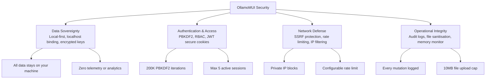

# Security Policy

## Security Architecture

## Supported Versions

| Version | Supported          |
|---------|--------------------|
| 1.0.x   | :white_check_mark: |

## Reporting a Vulnerability

This is a **local desktop application**. All API keys, credentials, and user data are stored **locally on your machine** and are never sent to any external server except the LLM providers you explicitly configure.

> **Note on the public site:** `https://ollamomui.vercel.app` is **static-only** (marketing pages). It has **no backend** and collects **no data, keys, or telemetry** — all sensitive data exists only in the locally-run desktop app.

### What's Protected

- **API keys** stored in PostgreSQL (`providers` table) — never exposed to the network
- **User credentials** stored in PostgreSQL (`users` table) using PBKDF2-HMAC-SHA256 with a per-user random salt — never transmitted
- **Documents & memory** stored in PostgreSQL with pgvector — never sent externally
- **ACL & audit logs** stored in PostgreSQL with role-based access control and rate limiting
- **Model catalog** stored in PostgreSQL — serves as fallback when no API key is configured
- **Session tokens** — 30-day expiry, max 5 active sessions per user, stored in PostgreSQL
- **All data stays on your machine** — zero telemetry, zero analytics, zero external calls

### Security Features

| Feature | Description |
|---------|-------------|
| **RBAC** | Role-based access control (admin/user) with per-route permission checks |
| **Rate Limiting** | Per-user request throttling (configurable via `OLLAMA_EMU_RATE_LIMIT`) |
| **Session Management** | 30-day token expiry, max 5 sessions per user, automatic cleanup |
| **IP Filtering** | Allowlist/blocklist for network-level access control |
| **Audit Logging** | All mutations logged with user, IP, and timestamp |
| **SSRF Protection** | Provider URLs are scheme-checked and blocked from private/loopback addresses |
| **Secure Binding** | Server binds to `127.0.0.1` by default; `--host 0.0.0.0` for LAN only |
| **Error Masking** | Internal paths and stack traces never exposed |
| **File Upload Safety** | Random temp filenames, extension sanitization, 10MB limit |
| **Password Hashing** | PBKDF2-HMAC-SHA256 with per-user random salt |

### Best Practices

1. Never commit `.env` files or database credentials to version control
2. Use the `OLLAMA_EMU_API_KEY` environment variable instead of the web UI for CI/CD environments
3. Regularly clear usage logs in the Usage page if you handle sensitive queries
4. The server binds to `127.0.0.1:11434` by default (restricted CORS). Pass `--host 0.0.0.0` to expose it on your LAN — only do this on a trusted network, as it opens CORS to all origins
5. Set `OLLAMA_EMU_ADMIN_EMAIL` for the admin account with full ACL permissions
6. Set a strong `OLLAMA_EMU_JWT_SECRET` in production environments
7. Configure `OLLAMA_EMU_RATE_LIMIT` appropriately for your usage patterns
8. Review audit logs periodically via `GET /api/audit/log`

### Reporting

If you discover a security issue, please do NOT open a public GitHub issue. Instead, report it privately.

Contact: Open a GitHub issue with the label `security` for non-critical issues, or reach out via the repository's security advisory feature.
